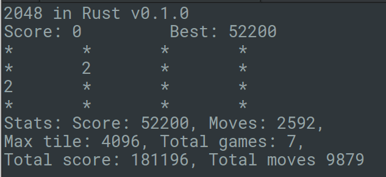

# 2048 in Rust [](https://www.gnu.org/licenses/gpl-3.0)
A small Rust implementation of 2048


## Controls
Use **WASD** or **arrows** to move tiles

`q` or `Ctrl+C` - quit

`b` - show stats



## Requirements
1. [Rust](http://www.rust-lang.org/install.html)
2. [Cargo](http://doc.crates.io/)
3. OS with ANSI terminals (Redox, Mac OS X, BSD, Linux, etc.)

## Building
```
$ cargo build
```
## Running
```
$ cargo run
```
